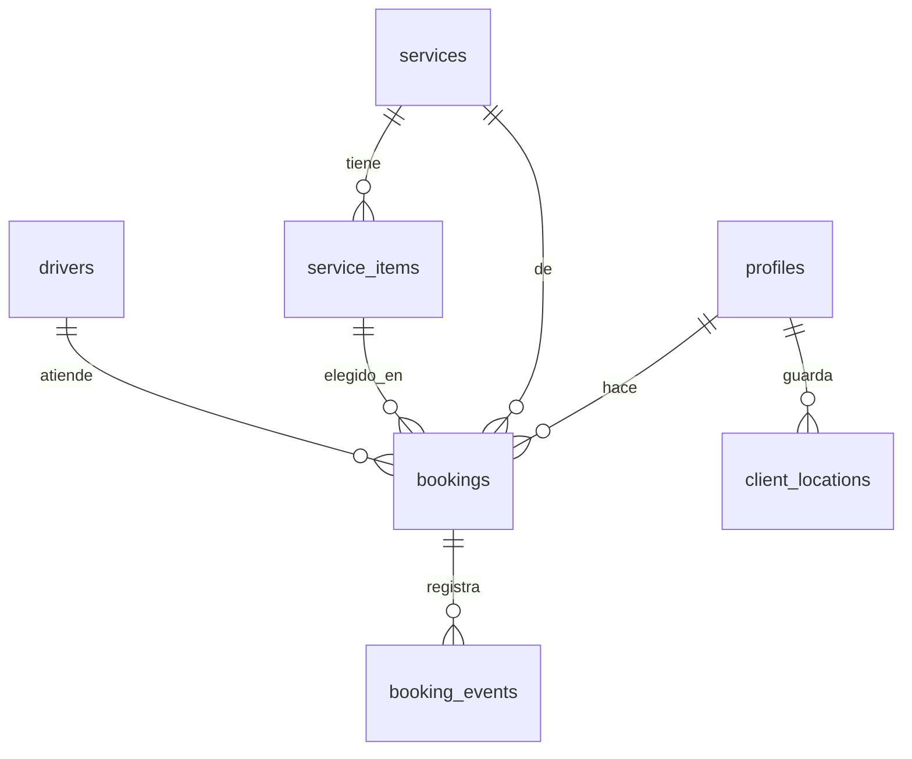

# Robert's Drivers — Arquitectura de la Plataforma (v2)

> v2: incorpora tus 14 puntos de feedback sobre v1. Cambios marcados con **[NUEVO]** o **[CAMBIO]**. Lo no marcado sigue igual que v1.

---

## 0. Qué cambió de v1 a v2 (resumen rápido)

- Conductores tendrán cuenta, pero en **Fase 2**, no en Fase 1.
- Métodos de pago: se agregan **efectivo** y **tarjeta (POS físico de Robert)** además de Yape. Solo Yape tiene flujo de comprobante dentro de la app; los demás son informativos, con detalle por WhatsApp de soporte.
- El pago es **voluntario** — el cliente decide si paga por adelantado o no.
- Se muestran los **4 servicios directo** en el home (sin "ver más").
- Nueva tabla `service_items`: paquetes (Full day), eventos (Eventos) y zonas (Chofer de reemplazo) — cada servicio puede tener sub-ítems propios que Robert administra.
- Nueva tabla `client_locations`: direcciones guardadas del cliente, con Google Maps.
- Nueva tabla `availability_blocks`: agenda/disponibilidad, empezando solo con Robert.
- `service_fields` (preguntas dinámicas en base de datos) se **pospone** — Fase 1 usa preguntas fijas en código, como en el boceto. Explico el porqué en la sección 4.
- Nuevo: `ticket_code` en cada reserva — un código corto (ej. `RD-0018`) que sirve para que el cliente confirme que quien lo contacta por WhatsApp es realmente el conductor asignado.
- El flujo de más de un paso se hace **pantalla por pantalla** (una pregunta a la vez, deslizando), no todo en un solo formulario.
- WhatsApp se mantiene como canal central de gestión y confirmación — la app no reemplaza esa conversación, la hace más rápida (las preguntas repetitivas ya están respondidas antes de escribir).
- Notificaciones fase 1 = botones en el panel de Robert que abren WhatsApp con un mensaje ya armado (no notificaciones push todavía).
- Reservas: el cliente puede editar/cancelar solo hasta cierto tiempo antes de la fecha agendada (el corte exacto se define con Robert).

---

## 1. Decisiones confirmadas

| Decisión | Elegido |
|---|---|
| Alcance | Solo el negocio de Robert |
| Login (Fase 1) | Correo y contraseña — más adelante, algo más rápido |
| Quién tiene cuenta | Clientes y Admin desde Fase 1. Conductores desde **Fase 2** |
| Pagos | Yape (con comprobante en la app), efectivo y tarjeta/POS (informativos, detalle por WhatsApp). Pago **voluntario** |
| Servicios visibles | Los 4 directo en el home: Traslados, Eventos, Chofer de reemplazo, Full day |
| Personalización | Robert edita servicios, sus ítems (paquetes/eventos/zonas), precios donde aplique, conductores, disponibilidad |
| Rol de WhatsApp | Canal central de gestión y confirmación — la app pre-responde lo repetitivo (precio, disponibilidad, forma de pago) para que la conversación sea más rápida |
| Stack | Next.js + Supabase (Postgres + Auth + Storage) + Vercel + Claude Code |

---

## 2. Roles

- **Cliente**: correo/contraseña. Pide servicios, guarda direcciones, sube comprobante si paga por Yape, ve estado y conductor asignado.
- **Admin (Robert)**: panel con dos tipos de módulos — *configuración* (servicios, ítems, precios, conductores, agenda) y *operación diaria* (cola de reservas, verificar pagos, asignar conductor, botones de WhatsApp).
- **Conductor**: **Fase 1** — sin cuenta, solo un registro que administra Robert. **Fase 2** — cuenta propia.

---

## 3. Modelo de datos

### `profiles`
| Campo | Tipo | Notas |
|---|---|---|
| id | uuid (PK, = auth.users.id) | |
| role | text | `'client'` \| `'admin'` \| `'driver'` *(driver desde Fase 2)* |
| full_name | text | |
| phone | text | |
| created_at | timestamptz | |

### `services`
| Campo | Tipo | Notas |
|---|---|---|
| id | uuid (PK) | |
| name | text | Traslados, Eventos, Chofer de reemplazo, Full day |
| slug | text | |
| description | text | |
| icon | text | |
| is_active | bool | |
| sort_order | int | los 4 se muestran directo, este define el orden |

### `service_items` **[NUEVO]**
Sub-ítems dentro de un servicio — su significado cambia según el servicio:
- **Eventos** → cada ítem es un evento (Cochinola, etc.) con fecha y precio.
- **Full day** → cada ítem es un paquete, con precio.
- **Chofer de reemplazo** → cada ítem es una zona (Lima, Miraflores/Callao, Sur Chico) con precio.
- **Traslados** → por ahora sin precio; puede usarse solo para etiquetar tipos ("Aeropuerto", "Paquetes") si Robert lo quiere, sin mostrar tarifa.

| Campo | Tipo | Notas |
|---|---|---|
| id | uuid (PK) | |
| service_id | uuid (FK → services) | |
| name | text | |
| description | text | |
| price | numeric, nullable | null = sin precio (caso Traslados) |
| event_date | timestamptz, nullable | solo para Eventos |
| is_active | bool | |
| sort_order | int | |

### `availability_blocks` **[NUEVO]**
Agenda — por ahora solo la de Robert; el campo `managed_by` deja listo el terreno para delegar a un compañero después.
| Campo | Tipo | Notas |
|---|---|---|
| id | uuid (PK) | |
| service_id | uuid, nullable (FK → services) | null = aplica en general |
| managed_by | uuid (FK → profiles) | hoy siempre Robert |
| date | date | |
| is_available | bool | |
| note | text | opcional |

### `client_locations` **[NUEVO]**
Direcciones guardadas del cliente (vía Google Maps), para que pedir un traslado sea casi de un toque.
| Campo | Tipo | Notas |
|---|---|---|
| id | uuid (PK) | |
| client_id | uuid (FK → profiles) | |
| label | text | "Casa", "Trabajo" |
| address_text | text | |
| lat | numeric | |
| lng | numeric | |
| is_default | bool | |

### `drivers`
| Campo | Tipo | Notas |
|---|---|---|
| id | uuid (PK) | |
| profile_id | uuid, nullable (FK → profiles) | se llena en Fase 2, cuando tengan cuenta |
| full_name | text | |
| car_model | text | |
| car_color | text | |
| plate | text | |
| phone | text | |
| photo_url | text | |
| is_active | bool | |

### `bookings`
| Campo | Tipo | Notas |
|---|---|---|
| id | uuid (PK) | |
| ticket_code | text, único | ej. `RD-0018` — visible al cliente y usado por el conductor al escribirle, para que el cliente confirme que es real |
| client_id | uuid (FK → profiles) | |
| service_id | uuid (FK → services) | |
| service_item_id | uuid, nullable (FK → service_items) | qué paquete/evento/zona, si aplica |
| form_data | jsonb | respuestas del formulario (fijo por ahora, ver sección 4) |
| origin_location | jsonb | `{address_text, lat, lng}` — de `client_locations` o ingresado ahí mismo |
| destination_location | jsonb, nullable | igual que origin |
| scheduled_for | timestamptz | cuándo lo quiere el cliente |
| wants_advance_payment | bool | el pago es voluntario — decide el cliente |
| payment_method | text, nullable | `'yape'` \| `'efectivo'` \| `'tarjeta_pos'` |
| payment_proof_url | text, nullable | solo si `payment_method = 'yape'` |
| status | text | `pending` → (`payment_uploaded` si aplica) → `confirmed` → `assigned` → `completed` → `cancelled` |
| driver_id | uuid, nullable (FK → drivers) | |
| can_edit_until | timestamptz | corte para editar/cancelar — valor exacto a definir con Robert |
| verified_by | uuid, nullable (FK → profiles) | |
| verified_at | timestamptz, nullable | |
| created_at / updated_at | timestamptz | |

### `booking_events`
Sin cambios respecto a v1 — historial de estados.

---

## 4. Sobre `service_fields` (tu pregunta del punto 7)

En v1 propuse guardar las *preguntas* de cada formulario en la base de datos, para que Robert pudiera crear un servicio nuevo con sus propias preguntas sin que yo tocara código.

**El trade-off real:**
- A favor: si algún día Robert quiere un servicio totalmente nuevo (ej. "Mudanzas") con preguntas distintas, lo arma él solo desde el panel.
- En contra: es más abstracto de construir bien, más piezas moviéndose, y más lento de sacar ahora — para 4 servicios que ya conoces y que no cambian de estructura seguido, es una complejidad que no se paga sola todavía.

**Decisión para Fase 1:** las preguntas de cada servicio van fijas en el código (como en el boceto que ya viste — Traslados pregunta origen/destino/cuándo, Full day pregunta plan/fecha, etc.), pantalla por pantalla. Si más adelante Robert empieza a pedir servicios nuevos seguido, migramos esa parte a base de datos sin tocar el resto del modelo.

---

## 5. Seguridad — explicado simple

Para que tanto Robert como sus clientes confíen en la app:

- Cada cliente solo puede ver **sus propias** reservas y direcciones guardadas — nadie más, ni siquiera otro cliente, puede verlas.
- Los comprobantes de pago (capturas de Yape) son privados: solo los ve el cliente que los subió y Robert.
- Las contraseñas nunca se guardan en texto plano — Supabase las cifra automáticamente.
- Cada reserva tiene un **código de ticket único** (ej. `RD-0018`). Cuando un conductor te escribe por WhatsApp diciendo que Robert lo asignó, tú puedes verificar en la app que ese es justamente tu conductor asignado para ese ticket — así sabes que no es alguien haciéndose pasar por el servicio.
- Robert es el único que puede verificar pagos y asignar conductores — un cliente no puede cambiar el estado de su propia reserva más allá de editarla o cancelarla dentro del plazo permitido.

*(Técnicamente esto se implementa con Row Level Security en Supabase — políticas que la base de datos aplica sola en cada consulta, no reglas que dependan de que el código de la app las recuerde aplicar.)*

---

## 6. Flujo del cliente (actualizado)

1. Registro/inicio de sesión.
2. Ve los **4 servicios directo** en el home.
3. Elige uno. Si el servicio tiene más de un paso, aparecen **uno a la vez**, pantalla completa, deslizando al siguiente — no todo amontonado en un solo formulario.
   - **Traslados**: origen (guardado antes o buscado con Google Maps) → destino → hoy/mañana/otro día + hora. Sin precio por ahora (posible estimado más adelante, a conversar con Robert).
   - **Eventos**: elige el evento (de `service_items`) → zona de salida.
   - **Chofer de reemplazo**: dónde está → a dónde va → cuándo.
   - **Full day**: elige paquete (con precio) → fecha (validada contra `availability_blocks`).
4. Pantalla de pago — **opcional**: el cliente decide si paga ahora. Si sí, elige Yape (ve el número, sube captura), efectivo o tarjeta (estos dos últimos solo quedan anotados; el detalle se coordina por WhatsApp de soporte). Si no quiere pagar ahora, sigue sin pagar.
5. Reserva creada con su `ticket_code`. Robert recibe automáticamente (vía botón en su panel) un WhatsApp con todo el detalle — incluyendo un link de Waze al punto de origen para que navegue directo ahí.
6. Cuando Robert verifica (si hubo pago) y asigna un conductor, el cliente ve en la app quién es el conductor — y ese conductor lo contacta por WhatsApp mencionando el `ticket_code`.
7. El cliente puede editar o cancelar su reserva hasta el corte definido en `can_edit_until`.

---

## 7. Panel de Robert — módulos

**Configuración**
- Servicios: activar/desactivar, agregar ítems (paquetes, eventos, zonas).
- Precios (donde aplica: Eventos, Full day, Chofer de reemplazo).
- Conductores: alta/baja, datos, foto.
- Disponibilidad/Agenda: bloquear o abrir fechas (hoy solo la suya).

**Operación diaria**
- Cola de reservas nuevas / pendientes de verificar pago.
- Ver comprobante, marcar pago verificado.
- Asignar conductor.
- Botones de mensaje de WhatsApp pre-armado (para Robert, y más adelante para avisar al conductor) — así la "notificación" en Fase 1 es un WhatsApp con un toque, no una notificación push.

**Reportes** *(fase futura)*
- Resumen de reservas e ingresos.

---

## 8. Fases de construcción (confirmadas, sin cambios de fondo)

**Fase 1** — Cimientos: Next.js + Supabase, login cliente/admin, tablas + RLS, home con los 4 servicios y sus formularios fijos.
**Fase 2** — Reserva y pago: flujo completo con `ticket_code`, subida de comprobante Yape, direcciones guardadas (Google Maps), disponibilidad para Full day. Conductores obtienen cuenta.
**Fase 3** — Panel de Robert completo: verificación de pago, asignación, botones de WhatsApp pre-armado, módulos de configuración.
**Fase 4** — Pulido: reportes, y evaluar si se justifica pasar `service_fields` a base de datos.

---

## 9. Sigue abierto

- Corte exacto de tiempo para editar/cancelar una reserva (`can_edit_until`) — a definir con Robert.
- Si Traslados mostrará un precio estimado más adelante, o se mantiene sin precio — a conversar con Robert.
- Si el pago adelantado será obligatorio para reservas "importantes" (a definir cuáles) — pendiente de decidir con Robert.
